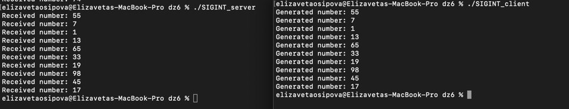
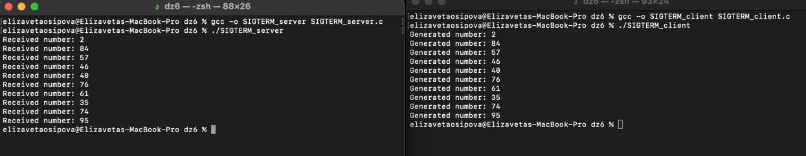
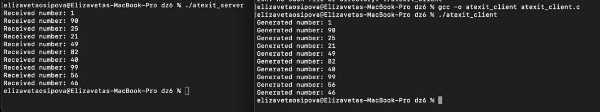

## Домашнее задание №6

### Осипова Елизавета Владимировна - БПИ-219

### Задание

Разработать программы клиента и сервера, взаимодействующих через разделяемую память с использованием функций UNIX SYSTEM V. Клиент генерирует случайные числа в том же диапазоне, что и ранее рассмотренный пример. Сервер осуществляет их вывод. Необходимо обеспечить корректное завершение работы для одного клиента и сервера, при котором удаляется сегмент разделяемой памяти.
Предложить и реализовать свой вариант корректного завершения.

### Отчет

Для обеспечения корректного завершения работы клиента и сервера, необходимо использовать сигналы. Один из вариантов - использование сигнала SIGINT (Ctrl+C), который отправляется при остановке программы с клавиатуры. При получении этого сигнала сервер должен корректно завершить свою работу и удалить разделяемую память. Аналогично, клиент также должен обработать сигнал SIGINT и завершить свою работу.

Сервер - [SIGINT_server.c](SIGINT_server.c)

Клиент - [SIGINT_client.c](SIGINT_client.c)

Дополнительно реализованы следующие варианты завершения работы:

1) Использование сигнала **SIGTERM**. Этот сигнал отправляется системой при запросе завершения работы программы. При получении этого сигнала сервер и клиент должны корректно завершить свою работу и удалить разделяемую память.

Сервер - [SIGTERM_server.c](SIGTERM_server.c)

Клиент - [SIGTERM_client.c](SIGTERM_client.c)

2) Использование функции **atexit()** для корректного завершения работы процессов. Клиент и сервер могут зарегистрировать функции с помощью функции atexit(), которые будут вызываться при завершении работы процессов. В этих функциях можно удалить сегмент разделяемой памяти и выполнить другие необходимые действия.

Сервер - [atexit_server.c](atexit_server.c)

Клиент - [atexit_client.c](atexit_client.c)

